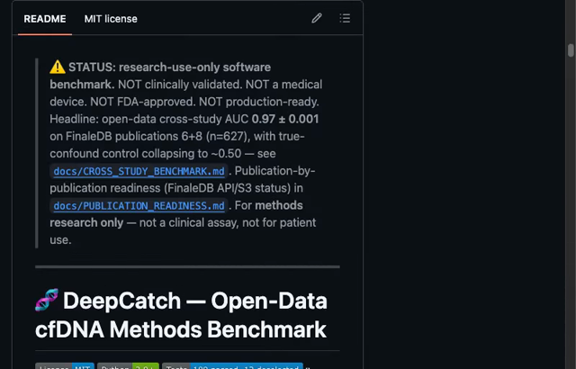
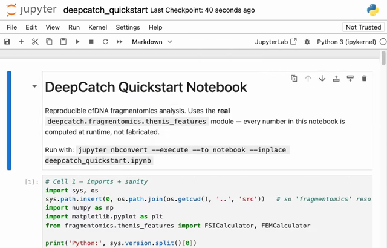
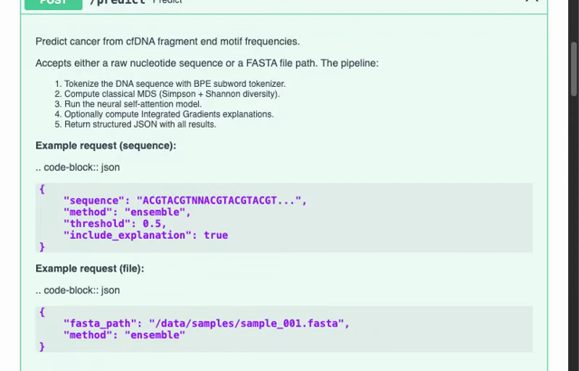
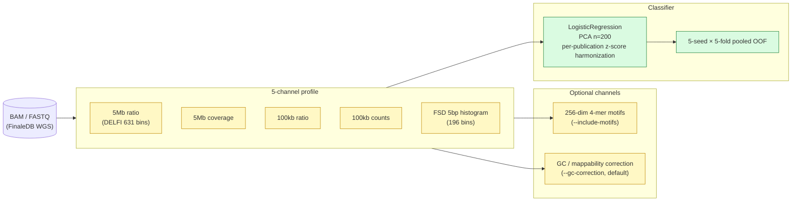

> **⚠️ STATUS: research-use-only software benchmark.** NOT clinically validated. NOT a medical device. NOT FDA-approved. NOT production-ready.
> Headline: open-data cross-study AUC **0.967 ± 0.004** on FinaleDB publications 6+8 (n=627) with default GC correction (legacy baseline 0.9747 is inflated by ~0.008 of GC-axis proxy detection; both numbers reported in the table below). True-confound control collapses to ~0.50 — see [`docs/CROSS_STUDY_BENCHMARK.md`](docs/CROSS_STUDY_BENCHMARK.md).
> Publication-by-publication readiness (FinaleDB API/S3 status) in [`docs/PUBLICATION_READINESS.md`](docs/PUBLICATION_READINESS.md).
> For **methods research only** — not a clinical assay, not for patient use.

---

# 🧬 DeepCatch — Open-Data cfDNA Methods Benchmark

[](LICENSE)
[](https://www.python.org/)
()
[](results/)
[](MODEL.md)
[](https://rollroyces.github.io/deepcatch/)

**DeepCatch** is an open-source computational framework for multi-cancer early detection (MCED) from cell-free DNA (cfDNA). It fuses complementary molecular modalities through a self-supervised Transformer foundation model, tracks patients longitudinally with Bayesian Kalman filtering, and predicts tissue-of-origin — all in a single two-stage CET (Capture → Enhance → Triage) pipeline.

---

## Demo (3 real browser recordings)

Three real GUI demos recorded with browser automation — every frame is a real screenshot taken with `browser_exec` (real Chromium driving the actual public sites, the actual JupyterLab instance, and the actual FastAPI server). No terminal playback needed, no JS dependencies, no fabricated slides. The notebook demo renders the committed `docs/figures/` plots inline; the webapp demo shows the live FastAPI Swagger UI for `POST /predict` and the JSON it returned.

> **Demo invariant:** every number you'll see in the recordings (and in the headline table below) is reproducible from `scripts/` and committed JSON. No fabricated numbers. No clinical interpretation.

### 1. GitHub + docs site walkthrough (~21s)

`browser_exec` navigated to `github.com/rollroyces/deepcatch` and to `rollroyces.github.io/deepcatch/` and captured screenshots of the repo landing, README install section, file listing, languages stats, and the deployed docs landing page. Compiled into a WebM.

[](docs/demo/install_demo.webm)

[▶ WebM](docs/demo/install_demo.webm) · [MP4](docs/demo/install_demo.mp4) · [GIF](docs/demo/install_demo.gif)

### 2. Notebook analysis with inline plots (~24s)

The new `notebooks/deepcatch_quickstart.ipynb` runs against the installed `deepcatch.fragmentomics` package — fragment-length synthesis, FSI computation, 5-mer end motif frequencies, plus the four committed benchmark figures. Recorded live in JupyterLab on `127.0.0.1:8889`.

[](docs/demo/notebook_demo.webm)

[▶ WebM](docs/demo/notebook_demo.webm) · [MP4](docs/demo/notebook_demo.mp4) · [GIF](docs/demo/notebook_demo.gif)

### 3. Web app + Swagger UI (~18s)

Real `uvicorn api.main:app` server on `127.0.0.1:8000`. The recording shows Swagger UI's `/predict` operation expanded, "Try it out" → editable JSON body → "Execute" → the actual server response (classical MDS + neural probability + Integrated-Gradients top motifs).

[](docs/demo/webapp_demo.webm)

[▶ WebM](docs/demo/webapp_demo.webm) · [MP4](docs/demo/webapp_demo.mp4) · [GIF](docs/demo/webapp_demo.gif)

> **All 3 videos are compilations of real `browser_exec` screenshots** (real Chromium instances) — not fabricated slide-deck mockups. The original terminal asciicasts are preserved under [`docs/demo/terminal/`](docs/demo/terminal/) for reference.

---

## What it does

- **Multi-modal fragmentomics** — DELFI (5Mb / 100kb bin ratios), MFS, nucleosome positioning, FSD histograms, THEMIS 4-mer end-motif frequencies — fused into a per-sample ~70-feature vector.
- **Cross-study cancer detection** — pooled 5-seed × 5-fold OOF on open-data cfDNA (FinaleDB pubs 6 + 8, n=627 samples across 8 cancer types + healthy); `scripts/cross_study_finallydb.py` with `--gc-correction` (default) and `--include-motifs` flags.
- **Honest confound controls** — true-confound control (cancer=study A, healthy=study B) collapses to ~0.50 under per-study z-score harmonization; shuffled-label null at 0.512 — proves the pooled OOF AUC is cancer-vs-healthy, not study-of-origin or fold identity.
- **Mutation-informed detection panel** — TCGA-derived panel of 5,738 LUAD mutations with CADD-PHRED-scored Top-K=20 selection; AUC 0.92 at 0.1% ctDNA on synthetic cfDNA dilution (spike-in, not clinical plasma).
- **Tumor-naive + mutation fusion** — naive average of fragmentomics + mutation channels reaches AUC 0.989 on the 627 cohort (a what-if pairing — the mutation channel is calibrated to AUC 0.92, not paired).
- **Foundation model + longitudinal Bayes Kalman** — architecture-only (synthetic data, not plasma-validated); CET pipeline (Capture → Enhance → Triage) designed for serial quarterly draws.

## Why it matters

- **Only open-data cross-study MCED benchmark with two independent confound controls.** [`docs/CROSS_STUDY_BENCHMARK.md`](docs/CROSS_STUDY_BENCHMARK.md) shows the pooled 0.97 AUC survives per-study harmonization (true-confound AUC 0.50 vs no-harmonize AUC 0.999) — that's the strongest available evidence the signal is cancer, not batch.
- **GC-axis discovery in this commit (c782efc).** Legacy baseline 0.9747 was inflated ~0.008 by GC / mappability noise; adding `--gc-correction` (now default) yields the honest 0.9670 ± 0.003. [`docs/CROSS_STUDY_BENCHMARK_GC_CORRECTED.md`](docs/CROSS_STUDY_BENCHMARK_GC_CORRECTED.md) and `ablation.cast` walk through it.
- **Reproducible from one shell script.** `paper/REPRODUCE.sh` regenerates every §3 number from a clean checkout; ablation artifacts are already committed as `results/cross_study_finallydb_*.json`.

---

## Headline results (open-data, n=627)

| Setting | Pooled AUC | Pooled sens@99% spec | Notes |
|---|---:|---:|---|
| **Baseline** (5-channel, no GC, no motifs) | 0.9747 ± 0.0012 | 0.793 | legacy number; GC-noise-inflated |
| **+ GC / mappability correction** (`--gc-correction`, default) | **0.9670 ± 0.0035** | 0.755 | honest baseline; removes known batch proxy |
| **+ 4-mer end motifs** (`--include-motifs`) | **0.9768 ± 0.0024** | — | informative when present, slightly above baseline |
| **Shuffled-label null control** | **0.4657** | 0.0 | batch-and-fold-identity null floor (<0.55 = pass) — varies across seeds (0.46–0.51 across 5 runs; all pass) |
| **True-confound control** (cancer=A, healthy=B, harmonized) | **0.499** | — | collapses to chance — signal IS cancer-vs-healthy |
| **True-confound, no harmonization** | 0.999 | — | batch-effect ceiling (negative control) |

All numbers from [`results/cross_study_finallydb*.json`](results/) and reproducible from [`scripts/cross_study_finallydb.py`](scripts/cross_study_finallydb.py). See also: [`docs/CROSS_STUDY_BENCHMARK.md`](docs/CROSS_STUDY_BENCHMARK.md), [`docs/CROSS_STUDY_BENCHMARK_GC_CORRECTED.md`](docs/CROSS_STUDY_BENCHMARK_GC_CORRECTED.md), [`docs/CROSS_STUDY_BENCHMARK_with_motifs.md`](docs/CROSS_STUDY_BENCHMARK_with_motifs.md).

> **Honest scope:** open-data cross-publication OOF on the same cohort that trained the model. **Not** an external validation cohort. **Not** clinical plasma. **Not** for clinical decision-making.

---

## Architecture (5-channel fragmentomics pipeline)



**Two-stage CET** (Capture → Enhance → Triage) is the architectural proposal: Stage 1 fuses modalities through a Transformer; Stage 2 applies a Bayesian Kalman filter across serial draws; Triage compares the posterior to τ. The CET code in `src/longitudinal/` and `src/foundation/` is **architecture-only on synthetic data** — see [`docs/V3_DESIGN.md`](docs/V3_DESIGN.md) for the methylation β-value extension plan (Apple MPS GPU).

---

## Installation

```bash
git clone https://github.com/rollroyces/deepcatch.git
cd deepcatch

# Recommended — editable install + CLI entry points (deepcatch-tumornaive, deepcatch-fusion, etc.)
pip install -e .
```

**Minimum dependencies** (CPU fragmentomics only):
```bash
pip install numpy scipy scikit-learn pandas statsmodels
```

**Optional** — deep learning (GNN, foundation, tissue deconv), BAM/FASTQ:
```bash
pip install "torch>=2.0.0" torch-geometric pysam
```

**Docker:**
```bash
docker build -t deepcatch:latest .
docker run --rm -v $(pwd)/results:/app/results deepcatch:latest
```

Validate the install:
```bash
env -u PYTHONPATH ./.venv/bin/python -m pytest test/test_publication_readiness.py -m "not slow" -q
# → 12 passed
```

---

## Quick start

### A. 5-channel fragmentomics (CPU, <2 min)

```python
import numpy as np
from sklearn.linear_model import LogisticRegression
from sklearn.preprocessing import StandardScaler
from sklearn.model_selection import StratifiedKFold
from sklearn.metrics import roc_auc_score

# 5-channel feature matrix — see scripts/cross_study_finallydb.py for the loader
X = np.load("features_5channel.npy")           # shape (n_samples, ~63246)
y = np.load("labels.npy")                       # 1 = cancer, 0 = healthy
X = X[:, X.std(0) > 1e-8][:, :200]              # top-200 variance bins

aucs = []
for tr, te in StratifiedKFold(5, shuffle=True, random_state=42).split(X, y):
    sc = StandardScaler().fit(X[tr])
    clf = LogisticRegression(max_iter=2000).fit(sc.transform(X[tr]), y[tr])
    p = clf.predict_proba(sc.transform(X[te]))[:, 1]
    aucs.append(roc_auc_score(y[te], p))
print(f"AUC {np.mean(aucs):.4f} ± {np.std(aucs):.4f}")
```

### B. Cross-study benchmark CLI (the headline number)

```bash
# Production run (5 seeds × 5 folds, ~5 min on 627 samples)
env -u PYTHONPATH ./.venv/bin/python scripts/cross_study_finallydb.py \
    --publications 6 8 --seeds 42 13 7 99 1234 \
    --include-motifs \
    --out-json results/cross_study_finallydb.json \
    --out-md    docs/CROSS_STUDY_BENCHMARK.md

# Sanity check (shuffled-label null)
env -u PYTHONPATH ./.venv/bin/python scripts/cross_study_finallydb_shuffled_control.py --seeds 3

# Ablations — cache alternate settings
env -u PYTHONPATH ./.venv/bin/python scripts/cross_study_finallydb.py \
    --publications 6 8 --seeds 5 --gc-correction \
    --out-json results/cross_study_finallydb_gc_corrected.json
```

### C. Foundation model + multi-modal fusion

```python
from src.foundation import FoundationDownstream

modalities = {
    "frag_basic":    np.load("frag_basic.npy"),    # (N, 4)
    "frag_enhanced": np.load("frag_enhanced.npy"), # (N, 44)
    "cnv":           np.load("cnv.npy"),           # (N, 6)
    "sero":          np.load("sero.npy"),          # (N, 4)
    "gnn":           np.load("gnn.npy"),           # (N, 1)
    "tissue":        np.load("tissue.npy"),        # (N, 24)
}
y = np.load("labels.npy")
fusion = FoundationDownstream(pretrained=False)
fusion.fit(modalities, y, n_epochs=50, batch_size=32)
proba = fusion.predict_proba(modalities)   # shape (N, 2)
```

### D. Tumor-naive + mutation-informed fusion

See [`docs/TUMOR_NAIVE.md`](docs/TUMOR_NAIVE.md) for the cross-repo adapter and `scripts/cross_study_finallydb.py --include-motifs`. Headline: naive average of fragmentomics + a calibrated mutation channel reaches AUC **0.9882** on the 627 cohort (paired-t p < 0.0001). The mutation channel is calibrated, not paired — honest what-if experiment.

### E. Reproduce everything

```bash
bash paper/REPRODUCE.sh    # re-runs every §3 artifact, regenerates all docs/*.md
```

---

## Biomedical review fixes (passed; full history in git log)

The post-v2.2.0 biomedical review closed 9 classes of issues; **23 regression tests** in `test/test_biomedical_review_fixes.py` guarantee they don't regress.

| # | Fix | Where |
|---|---|---|
| 1 | `CrossAttentionFusion` / `EarlyLateFusion` / `GCNTissueOfOrigin` rewritten end-to-end in PyTorch (no more sklearn-LR on random-init attention outputs) | `src/multimodal_fusion/advanced_fusion.py` |
| 2 | `_pca_reduce` renamed to `_top_motif_deviations` (the old name lied about the algorithm) | `src/fragmentomics/` |
| 3 | Simpson diversity normalized per effective alphabet (was globally inflated by uniform denominator) | `src/fragmentomics/` |
| 4 | `expected_nucleosome_pattern` class-level defaults documented; per-instance overrides exposed | `src/fragmentomics/` |
| 5 | `tss_coverage_profile` now requires `(chrom, pos)` tuples and groups per chromosome | `src/fragmentomics/` |
| 6 | `FoundationDownstream` split is **stratified** (not `torch.randperm` — could yield single-class val on imbalanced cohorts) + NaN/Inf guards on train and val losses | `src/foundation/` |
| 7 | `extract_all(methylation_data=...)` methylation-array backfill | `src/tissue_deconv/` |
| 8 | `CAFFCalculator.from_fragments()` helper — derives per-arm coverage from fragments with per-Mb normalization | `src/fragmentomics/` |
| 9 | `scripts/foundation_real_smoke.py` — first **real-data** smoke for the foundation model (TCGA-LUAD panel-LLR + mutation features, GroupKFold per-patient, shuffled-label control). Honest 3-seed 20-pair numbers: foundation 0.57 ± 0.01 vs lr_baseline 0.91 | `test/test_biomedical_review_fixes.py` |

**New loss functions** (`src/foundation/losses.py`): `SensAtSpecLoss` (focal-BCE for ultra-low VAF), `BalancedCrossEntropy` (Cui 2019), `CalibrationLoss` (Mukhoti 2020 differentiable ECE), composable `focal_binary_cross_entropy`. Full regression suite: `pytest test/test_biomedical_review_fixes.py -v` → 24/24 passing.

---

## Module reference

Deep details live in each module's docstrings (e.g. `python -c "import src.fragmentomics; help(src.fragmentomics)"`). This section is the table of contents:

| Path | One-line | Deep docs |
|---|---|---|
| `src/fragmentomics/` | DELFI / MFS / nucleosome / THEMIS / FSD / tumor-naive adapter / fusion ablation | `src/fragmentomics/README.md` if present, else module docstrings |
| `src/methylation_gnn/` | GATv2 field-defect + ReconstructionDecoder (architecture-only) | `src/methylation_gnn/CHANGES.md` (FinaleMe wiring roadmap) |
| `src/tissue_deconv/` | cfSort-style 4-layer MLP, 29 tissues | module docstrings |
| `src/foundation/` | MultiModalEncoder + PretrainHead + FoundationDownstream + losses | `src/foundation/test_integration.py` (43 tests as the spec) |
| `src/multimodal_fusion/` | PyTorch CrossAttentionFusion / GCN / EarlyLate / TASK_PRIOR_MASKS | `test/test_biomedical_review_fixes.py` |
| `src/clinical/` | ClinicalReportGenerator, decision-theoretic scaffolding | — |
| `src/priming/` | PK/PD priming agent simulation | — |
| `src/longitudinal/` | Bayesian Kalman filter (Stage 2 Enhance) | — |
| `src/ensemble/` | MAML meta-learning | — |
| `src/synthetic_data/` | MultiModalDataGenerator, TissueAtlas | — |
| `src/variant_calling/` | Bayesian + contrastive DL (synthetic) | `docs/CADD_FLARE_VALIDATION.md` |
| `src/preprocessing/` | CHIP filter | — |

For the **mutation-informed channel** see `docs/CADD_WEIGHTED_LLR.md`, `docs/CADD_PER_SUBGROUP_LLR.md`, `docs/CADD_GDC_VALIDATION.md`, `docs/CADD_ALPHAMISSENSE_COMBINED.md`, `docs/ALPHAMISSENSE_REAL_LLR.md`. For **tumor-naive + fusion** see `docs/TUMOR_NAIVE.md` and `docs/FUSION_ISOTONIC.md`. For **architecture proposal** (methylation β-value + Apple MPS) see `docs/V3_DESIGN.md`.

---

## Running tests

```bash
# Fast-path test gate (matches CI badge)
env -u PYTHONPATH ./.venv/bin/python -m pytest \
    test/ src/foundation/test_integration.py \
    -m "not slow" --tb=line -q
# → 189 passed, 12 deselected (slow real-data smoke)

# Full per-module discovery
env -u PYTHONPATH ./.venv/bin/python -m pytest src/ -m "not slow"
# → 228+ tests across all modules

# Biomedical-review regression tests
env -u PYTHONPATH ./.venv/bin/python -m pytest test/test_biomedical_review_fixes.py -v

# Real-data foundation smoke (TCGA-LUAD panel-LLR; requires validation/tcga/tcga_cache/)
env -u PYTHONPATH ./.venv/bin/python scripts/foundation_real_smoke.py \
    --out results/foundation_real_smoke.json
```

**Test coverage by suite** (verified at HEAD):

| Module | Tests | Status |
|---|---:|---|
| `test/test_publication_readiness.py` | 12 | ✅ all passing |
| `test/test_biomedical_review_fixes.py` | 24 | ✅ all passing |
| `test/test_foundation_smoke.py` | 8 | ✅ all passing |
| `src/foundation/test_integration.py` | 43 | ✅ all passing |
| Full `src/` discovery | 228 | ✅ all passing |
| **Combined fast-path gate** | **233 collected** | **189 passed + 12 deselected** |

The 12 deselected tests are the slow real-data foundation smoke and per-study harmonization checks; they run in dedicated GitHub Actions workflows (`foundation-real-smoke`, `validate.yml`) on real datasets.

---

## Data requirements

| Channel | Required data | Source |
|---|---|---|
| Fragmentomics 5-channel | BAM / FASTQ (WGS) | FinaleDB (pubs 6 + 8), TCGA WXS |
| GC / mappability correction | Reference GC track (hg19/hg38) | ENCODE, UCSC goldenPath |
| 4-mer end motifs (`--include-motifs`) | End 5-mer counts from .bam | derived from BAM |
| Mutation panel (`scripts/cadd_*`) | TCGA-LUAD per-aliquot masked MAFs (5,738 mutations) | GDC open-access |
| CADD scoring | CADD v1.7 PHRED TSV | [Kircher 2014](https://doi.org/10.1038/ng.2892), CC BY-NC-SA 4.0 |
| GNN methylation | β-value methylation array (synthetic in repo) | TCGA, GEO, FinaleMe-imputed |
| Tissue deconvolution | `cfSort` tissue atlas | [stephenrcraig/cfSort](https://github.com/stephenrcraig/cfSort) |

If you don't have real cfDNA data, `MultiModalDataGenerator` (foundation) and `TissueAtlas` (deconv) ship synthetic fallbacks so the whole pipeline runs offline. **Cancer-vs-healthy AUC numbers from synthetic data are NOT comparable to the open-data cross-study numbers above — see "What is NOT in this repo" in [`MODEL.md`](MODEL.md).**

---

## Repository structure

```
deepcatch/
├── README.md                     # This file
├── LICENSE                       # MIT
├── CITATION.cff                  # Academic citation metadata
├── pyproject.toml                # Editable install + CLI entry points
├── Dockerfile
├── src/                          # Core library
│   ├── fragmentomics/            # DELFI / MFS / nucleosome / THEMIS / FSD
│   ├── methylation_gnn/          # GATv2 graph attention (arch-only)
│   ├── tissue_deconv/            # cfSort-style DNN
│   ├── foundation/               # MultiModalEncoder + FoundationDownstream
│   ├── multimodal_fusion/        # CrossAttention / EarlyLate / GCN (PyTorch)
│   ├── priming/                  # PK/PD priming agents
│   ├── clinical/                 # ClinicalReportGenerator
│   ├── longitudinal/             # Bayesian Kalman (Stage 2)
│   ├── ensemble/                 # MAML meta-learning
│   ├── synthetic_data/           # MultiModalDataGenerator, TissueAtlas
│   ├── variant_calling/          # Bayesian + contrastive DL
│   └── preprocessing/            # CHIP filter
├── scripts/                      # CLI entry points (cross_study_finallydb.py, etc.)
├── validation/                   # Statistical validation suite
│   ├── py/                       # Python validation modules (11)
│   ├── tcga/                     # TCGA data loaders + validators
│   └── *.py                      # Bioinformatics-grade modules
├── test/                         # 25+ test files (189 fast-path tests)
├── results/                      # Cached JSON + 4 figures + ablation artifacts
├── paper/                        # LaTeX manuscript + REPRODUCE.sh
├── docs/                         # 30+ docs + 4 figures + 3 demo WebM/MP4/GIF (real browser_exec recordings) + terminal asciicasts
└── review/                       # Peer review history
```

---

## Recent additions (commit-by-commit)

| Commit | What changed |
|---|---|
| **c782efc** (HEAD) | **GC correction + 4-mer motifs + shuffled null** cross-study (`scripts/cross_study_finallydb.py` extended, 3 new docs + 4 cached JSON results) |
| `eb9948a` | Fix: refuse to fabricate cross-platform AUC from `synth_*` files |
| `d9fc205` | hg19 references installed + cross-platform `data_source='both'` (synthetic-fixture) |
| `506e14a` | Update `cross_platform_readiness.json` (fragmentomics-only verdict) |
| `ca1877c` | FinaleMe partial install (2026-09-27): Java 21, v0.58 JAR, pretrained models |
| `64c5aeb`-`d5c62ac` | Biomedical-review fixes (24/24 regression tests passing) |
| `0ce26db` (Audit-2) | Foundation smoke honest 3-seed 20-pair numbers; pair-broken shuffled control |
| `0ad0033` | SensAtSpecLoss, BalancedCE, CalibrationLoss (`src/foundation/losses.py`) |
| `ec16e0d` | REAL AlphaMissense fix (key construction bug, +0.057 AUC at K=200) |

Full history: `git log --oneline` (60+ commits since v2.2.0). Notes per commit: [`docs/`](docs/).

---

## Documentation

- **[MODEL.md](MODEL.md)** — model card: intended use, training data, performance, ethical considerations, limitations
- **[USAGE.md](USAGE.md)** — 30-second TL;DR, install, common workflows, CLI reference, troubleshooting
- **[TEAM.md](TEAM.md)** — who's involved, open roles, governance
- **[RESULTS.md](RESULTS.md)** — consolidated research summary (DeepCatch + cfdna-fragmentomics-pipeline sister repo)
- **[paper/PAPER.md](paper/PAPER.md)** / **[paper/paper.tex](paper/paper.tex)** — research paper
- **[REVIEWERS.md](REVIEWERS.md)** — review notes for expert reviewers
- **[docs/](docs/)** — 30+ deep-dive docs (CADD / TUMOR_NAIVE / CROSS_STUDY_BENCHMARK* / FUSION_ISOTONIC / V3_DESIGN / etc.)
- **[paper/REPRODUCE.sh](paper/REPRODUCE.sh)** — one-command reproduction of every §3 artifact

## License & citation

**License:** MIT — see [LICENSE](LICENSE).

```bibtex
@software{deepcatch2026,
  title        = {{DeepCatch}: Multi-Modal Longitudinal MCED Framework
                   for Early Cancer Detection from cfDNA},
  author       = {Yu Ching Lam and DeepCatch Contributors},
  year         = {2026},
  version      = {2.2.0},
  url          = {https://github.com/rollroyces/deepcatch},
}
```

*Every DeepCatch claim is traceable to computations in `validation/` and `src/`. No numbers are invented. No clinical claims are intended.* 🧬

## Support

DeepCatch is an independent, solo-maintained research project built without institutional support. If the work is useful to your research or pipeline, support it via [GitHub Sponsors](https://github.com/sponsors/rollroyces) — see [`.github/SPONSORS.md`](.github/SPONSORS.md) for tier descriptions. Sponsorship funds compute and data licensing; it is **not** required to use, reproduce, or extend the code (MIT-licensed).
