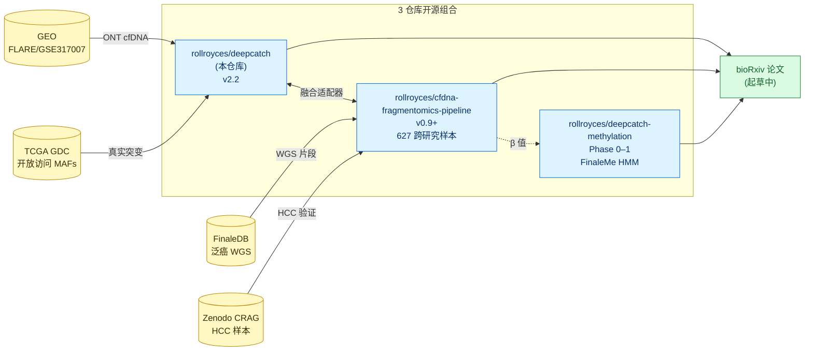
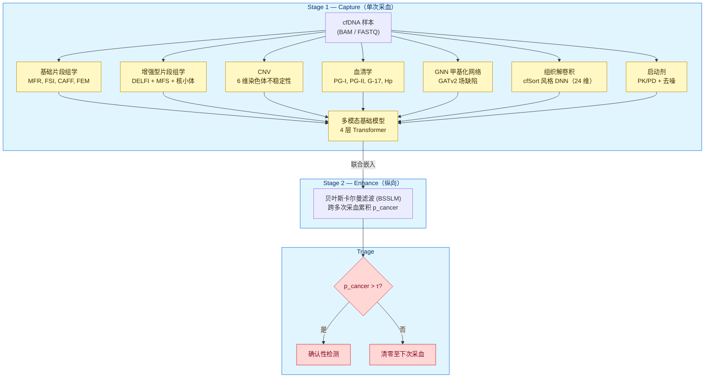
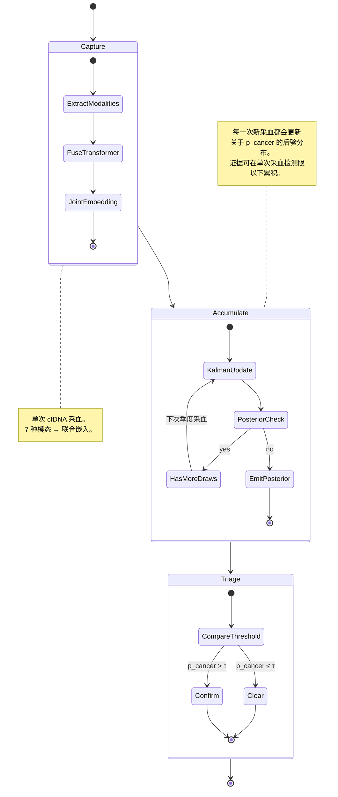
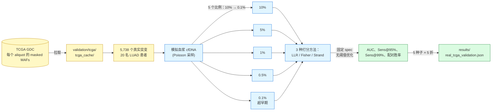
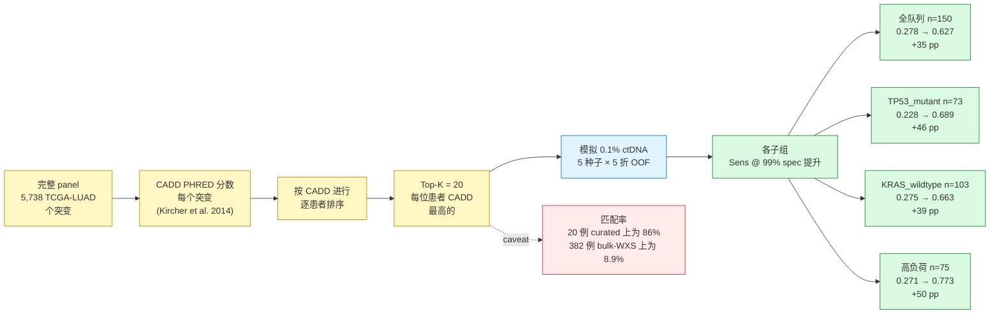
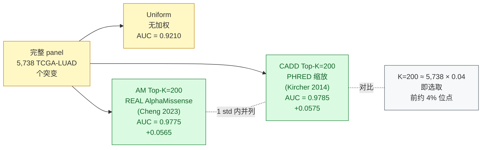
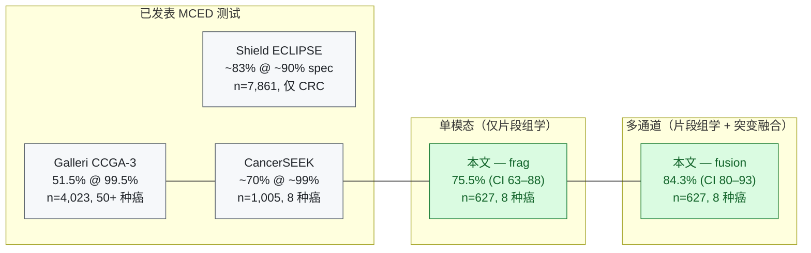

# 🧬 DeepCatch v2.2 — 基于检测 Panel 的超灵敏 MRD 检测

> ⚠️ **简体中文翻译 / Simplified Chinese Translation**
> 本文档是 [README.md](README.md) 的简体中文译版。**如与英文原版存在任何不一致，以英文原版为准。**
> 翻译者注：技术术语（API、AUC、OOF、LLR、CADD、AlphaMissense、BAM、FASTQ、cfDNA、ctDNA 等）保留英文原文。

[](LICENSE)
[](https://www.python.org/)
[]()
()
[](MODEL.md)
[](https://github.com/rollroyces/deepcatch)
[](https://github.com/sponsors/rollroyces)
[](https://rollroyces.github.io/deepcatch/)

> **🔥 正在寻求专家评审 — 请参阅 [REVIEWERS.md](REVIEWERS.md)。**
> Tag v2.2.0：基于 panel 的 MRD benchmark，全部数据开放访问。
> 等待评审的 PR：https://github.com/rollroyces/deepcatch/pull/2

**DeepCatch** 是一个用于从游离 DNA（cfDNA）进行多癌种早期检测（MCED）的开源计算框架。它通过自监督 Transformer 基础模型融合 **7 种互补的分子模态**，借助贝叶斯卡尔曼滤波对患者进行纵向追踪，并预测组织来源——所有功能在单一的两阶段 CET（Capture → Enhance → Triage，即"捕获 → 增强 → 分诊"）流水线中完成。

### 项目结构



> 💚 **赞助本项目：** 请参阅 [.github/SPONSORS.md](.github/SPONSORS.md) 了解赞助层级说明（$5 / $49 / $499 月付）。100% 的资金用于算力与维护。[GitHub Sponsors →](https://github.com/sponsors/rollroyces)

v2.1 新增了基于 GNN 的甲基化场缺陷检测、增强型片段组学（DELFI + MFS + 核小体 + 优化的 5-mer）、cfSort 风格的组织解卷积、多模态基础模型，以及启动剂（priming agent）的 PK/PD 模拟。

> 📋 **进行中的项目：** 甲基化通道扩展（Phase 0-2，起始于 2026-09-10）。
> 使用 FinaleMe（Liu 2024, *Nat Commun*）从既有 FinaleDB WGS 数据中推断 CpG 甲基化状态——无需新增原始数据。完整方案请参阅 [`METHYLATION_PROJECT.md`](METHYLATION_PROJECT.md)。

---

> ⚠️ **研究阶段软件。** 不可用于临床诊断。真实血浆验证状态见 §11。

---

## 架构

DeepCatch 是一个 **两阶段 CET 流水线**（Capture → Enhance → Triage）。第 1 阶段通过 Transformer 基础模型融合来自同一份 cfDNA 样本的七种分子模态；第 2 阶段借助贝叶斯卡尔曼滤波在多次纵向采血间累积证据；Triage 阶段将后验概率与校准阈值进行比较。



> GPU 加速的 v3 设计提案（在 Apple MPS 上将甲基化 β 值嵌入作为第 6 通道加入）请参阅 [V3_DESIGN.md](docs/V3_DESIGN.md)。

---

## 安装

```bash
git clone https://github.com/rollroyces/deepcatch.git
cd deepcatch
# 推荐：pip install -e . 会暴露 CLI 入口（deepcatch-tumornaive、deepcatch-fusion 等）
pip install -e .

# 或最小化安装（仅依赖项，无 console 脚本）
pip install -r requirements_py.txt
```

**最小依赖：**
```bash
pip install numpy scipy scikit-learn pandas
```

**含深度学习模块（GNN、基础模型、组织解卷积）：**
```bash
pip install torch>=2.0.0 torch-geometric
```

**可选 — BAM/FASTQ 处理：**
```bash
pip install pysam statsmodels
```

**Docker：**
```bash
docker build -t deepcatch:latest .
docker run --rm -v $(pwd)/results:/app/results deepcatch:latest
```

---

## 快速上手

### 1. 特征提取（7 种模态）

```python
import numpy as np
from src.fragmentomics import EnhancedFragmentomics
from src.fragmentomics.themis_features import (
    MFRCalculator, FSICalculator, CAFFCalculator, FEMCalculator
)
from src.methylation_gnn import RegulatoryGraphBuilder, MethylationGNNPredictor
from src.tissue_deconv import DEConvIntegration
from src.priming.pharmacokinetics import PKModel, OptimalDosingSchedule

# ── 基础片段组学 ──
mfr = MFRCalculator()
fsi = FSICalculator()
caff = CAFFCalculator()
fem = FEMCalculator()

frag_basic = {
    "mfr": mfr.compute(coverage, cpg_density),
    "fsi": fsi.compute(fragment_lengths),
    "caff": caff.compute(cnv_profile),
    "fem": fem.compute(end_motif_counts),
}

# ── 增强型片段组学（DELFI + MFS + 核小体 + 5-mer） ──
ef = EnhancedFragmentomics()
frag_enhanced = ef.extract_all(
    fragment_lengths=lengths,
    fragments=fragments,
    end_sequences=end_seqs,
    tss_positions=tss_positions,
)
# → 约 70 维标量特征的字典

# ── GNN 甲基化网络 ──
gnn = MethylationGNNPredictor.load("checkpoints/gnn_pretrained.pt")
graph = RegulatoryGraphBuilder().build_graph(
    sample_name="S001", methylation_data=meth_data
)
field_defect_score = gnn.predict_sample(
    sample_name="S001", methylation_data=meth_data
)

# ── 组织解卷积 ──
deconv = DEConvIntegration(checkpoint="checkpoints/deconv.pt")
# 或在合成混合物上从零训练：
# deconv.fit_synthetic(n_samples=2000)
tissue_fractions = deconv.predict_tissue_fractions(methylation_data)
tissue_features = deconv.extract_all(methylation_data, tissue_fractions)
# → 24 维标量特征的字典

# ── CNV ──
cnv_features = {
    "cnv_burden": np.mean(np.abs(cnv_log2_ratios)),
    "cnv_entropy": scipy.stats.entropy(cnv_segment_lengths),
    "arm_imbalance": max_arm_imbalance(cnv_profile),
}

# ── 血清学 ──
sero_features = {
    "pg1": pg1_value, "pg2": pg2_value,
    "g17": g17_value, "hp": hp_igg_value,
}

# ── 启动剂 PK/PD ──
pk = PKModel()
pk_result = pk.simulate(
    agent="scFv", dose_mg=100, patient_weight_kg=70,
    duration_hours=48,
)
dosing = OptimalDosingSchedule().compute(
    agent="scFv", patient_data={"weight_kg": 70}
)
```

### 2. 基础模型融合

```python
from src.foundation import FoundationDownstream, FoundationConfig

# 组装模态字典（每个 key 为 n_samples × dim）
modalities = {
    "frag_basic":    np.array(frag_basic_array),     # (N, 4)
    "frag_enhanced": np.array(frag_enhanced_array),  # (N, 44)
    "cnv":           np.array(cnv_array),            # (N, 6)
    "sero":          np.array(sero_array),           # (N, 4)
    "gnn":           np.array(gnn_scores),           # (N, 1)
    "tissue":        np.array(tissue_array),         # (N, 24)
}

# 使用预训练 checkpoint
fusion = FoundationDownstream(pretrained=True)
fusion.fit(modalities, labels)
proba = fusion.predict_proba(modalities)      # 形状 (N, 2)
predictions = fusion.predict(modalities)       # 形状 (N,)

# 或从零训练（无需预训练）
fusion = FoundationDownstream(pretrained=False)
fusion.fit(modalities, labels, n_epochs=50, batch_size=32)
proba = fusion.predict_proba(modalities)
```

### 3. 旧版融合 API（CrossAttentionFusion）

```python
from src.multimodal_fusion.advanced_fusion import CrossAttentionFusion

# 每个模态对应一个 1 维评分数组
scores = [mfr_scores, fsi_scores, caff_scores, fem_scores, cnv_scores]
fusion = CrossAttentionFusion(n_modalities=5)
fusion.fit(scores, labels)
proba = fusion.predict_proba(scores)
```

### 4. 临床报告

```python
from src.clinical import ClinicalReportGenerator

crg = ClinicalReportGenerator(cet_df, fusion_result)
print(crg.generate_briefing())               # 一段式摘要
crg.export_json("report.json")               # 机器可读导出
with open("report.html", "w") as f:
    f.write(crg.generate_html_report())       # 完整 HTML 报告
```

### 5. 运行完整验证套件

```bash
bash RUN_ALL.sh               # 完整流水线
bash RUN_ALL.sh --quick       # 2 分钟冒烟测试
```

---

## 模块参考

### `src/fragmentomics/` — FragmentoSign

**用途：** cfDNA 断裂模式分析，实现 DELFI、MDS 及 THEMIS 等价的特征框架。

| 类 / 函数 | 描述 |
|---|---|
| `MFRCalculator` | 通过 CpG 密度打分计算甲基化片段比 |
| `FSICalculator` | 片段大小指数：短/长片段比 + GMM 亚核小体组分比例 |
| `CAFFCalculator` | 染色体非整倍性：从全基因组 bin 计算 CNA 负荷 |
| `FEMCalculator` | 片段末端基序：4-mer MDS + 基序嵌入（Jiang 2020）|
| `FragmentLengthGMM` | 4 组分高斯混合模型（亚-/单-/二-/三-核小体） |
| `DELFI_style_normalization` | LOESS GC 偏倚校正 + 可比对性过滤 |
| `compute_MDS` | 由 4/5-mer 计数计算基序多样性分数 |
| `EnhancedFragmentomics` | 统一提取器：DELFI + MFS + 核小体足迹 + 优化 5-mer |
| `extract_4mer_end_motifs` | 从 BAM 文件提取 4-mer |
| `extract_end_motifs_from_fastq` | 从 FASTQ 提取 4-mer |

**输入：** BAM/FASTQ 文件，或片段长度数组 + 末端序列
**输出：** 标量特征（4–80+ 维）、GMM 组分统计、MDS 分数
**测试：** 42 个（`test_enhanced_features.py`）

---

### `src/methylation_gnn/` — GNN 甲基化网络

**用途：** 通过基于甲基化调控图的 GATv2 图注意力机制检测癌前表观遗传场缺陷。

| 类 / 函数 | 描述 |
|---|---|
| `RegulatoryGraphBuilder` | 由甲基化数据 + Hi-C 接触构建异构图 |
| `MethylationGNN` | 带重构解码器 + 异常检测头的 GATv2 模型 |
| `GNNTrainer` | 3 阶段训练：掩码预训练 → 联合训练 → 微调 |
| `GNNInference` / `MethylationGNNPredictor` | 轻量推理，输出 `field_defect_score` |
| `ReferenceDataCatalog` | 下载 UCSC CpG 岛、ENCODE Hi-C、GENCODE 启动子、FANTOM5 增强子 |
| `MethylationBranchAdapter` | 与 CrossAttentionFusion 兼容的即插即用适配器 |

**输入：** cfDNA 甲基化 β 值 + 参考 Hi-C / 染色质数据
**输出：** 每个样本的图级 `field_defect_score`（标量）
**测试：** 46 个（`test_integration.py`）

---

### `src/tissue_deconv/` — 组织解卷积

**用途：** 使用 cfSort 风格 DNN 从甲基化数据预测 cfDNA 的组织来源比例。

| 类 / 函数 | 描述 |
|---|---|
| `TissueAtlas` | 29 种组织的参考甲基化图谱存储 |
| `TissueDeconvolutionModel` | 轻量 DNN（约 500K 参数）：[256, 128, 64] + BN + ReLU + Dropout |
| `TissueDeconvolutionEnsemble` | 含随机种子多样性的 3 模型集成 |
| `TissueDeconvTrainer` | 在合成混合物上使用 KL 散度 + L1 稀疏 + 熵正则 |
| `TissueDeconvolutionFeatures` | 由组织比例提取 24 维特征向量 |
| `DEConvIntegration` | 与既有流水线兼容的完整集成类 |

**输入：** cfDNA 甲基化 β 值（或用于训练的合成图谱）
**输出：** 各组织比例向量 + 24 维特征向量
**测试：** 47 个（`test_integration.py`）

---

### `src/foundation/` — 基础模型

**用途：** 自监督多模态 Transformer 预训练（针对 cfDNA）。可作为 `CrossAttentionFusion` 的即插即用替代品。

| 类 / 函数 | 描述 |
|---|---|
| `FoundationConfig` | 超参数 dataclass（embed_dim, n_heads, n_layers 等） |
| `MultiModalEncoder` | 带每模态线性投影的 4 层 TransformerEncoder |
| `PretrainHead` | 掩码模态预测头 |
| `ContrastiveHead` | 跨模态对比损失（InfoNCE） |
| `FoundationPretrainer` | 自监督预训练编排器 |
| `FoundationDownstream` | 与 CrossAttentionFusion API 兼容的下游微调 |
| `FoundationCompatibilityWrapper` | 用于无缝替换 CrossAttentionFusion 的包装器 |
| `MultiModalDataGenerator` | 用于预训练的合成多模态数据生成器 |

**预训练任务：**
1. 掩码模态预测 —— 由上下文重构被掩码的模态
2. 跨模态对比 —— 同一样本各模态之间的 InfoNCE

**API 兼容性：**
```python
# CrossAttentionFusion（旧）
fusion = CrossAttentionFusion(n_modalities=6)
fusion.fit(scores, labels)          # scores：1 维数组列表
proba = fusion.predict_proba(scores)

# FoundationDownstream（新，即插即用）
fusion = FoundationDownstream(pretrained=True)
fusion.fit(modalities, labels)      # modalities：(N, D) 数组的字典
proba = fusion.predict_proba(modalities)  # 形状 (N, 2)
```

**输入：** 模态数组字典 `{name: np.ndarray (N, D)}`
**输出：** 联合嵌入 (N, n_modalities, embed_dim)；分类概率 (N, 2)
**测试：** 43 个（`test_integration.py`）

---

### `src/priming/` — 启动剂

**用途：** 模拟 cfDNA 启动剂（Amplifyer Bio）的 PK/PD 及其对 ctDNA 检测的影响。

| 类 / 函数 | 描述 |
|---|---|
| `PKModel` | 一房室 PK 模型，一级消除 |
| `OptimalDosingSchedule` | 计算 5 种启动剂类型的最佳给药方案 |
| `PrimingConfig` | 基于文献 PK 参数的 dataclass |

**启动剂类型：** scFv、脂质体、纳米粒、聚合物胶束、树枝状大分子
**输入：** 启动剂类型、剂量、患者体重、肝功能
**输出：** 浓度-时间曲线、ctDNA 增强因子、最佳给药方案
**参考文献：** Martin-Alonso 等 (2024) *Science*

---

### `src/multimodal_fusion/` — 融合架构

| 类 / 函数 | 描述 |
|---|---|
| `CrossAttentionFusion` | 模态嵌入之间的关系感知 cross-attention |
| `GCNTissueOfOrigin` | 在低测序深度下用于 TOO 预测的异构 GCN |
| `EarlyLateFusion` | 样本-模态评估 MLP |

---

### `src/clinical/` — 临床集成

| 类 / 函数 | 描述 |
|---|---|
| `SerologicalFusion` | 将 PG-I、PG-II、G-17、H. pylori 与 cfDNA 预测融合 |
| `IntegrativeScoringSystem` | 跨所有模态的统一风险评分 |
| `ClinicalReportGenerator` | 生成面向临床医生的 HTML/JSON 报告 |
| `NestedCETValidator` | 用于无偏基于基序的 CET 评估的嵌套交叉验证 |
| `FrequencyDataset` | 加载预计算的 4-mer 频次向量（Jiang lab 格式） |

---

### `src/longitudinal/` — Stage 2：Enhance

基于贝叶斯卡尔曼滤波（BSSLM）的纵向证据累积，用于跨季度采血。追踪患者风险轨迹而非依赖单时间点决策。

---

### `src/ensemble/` — 元学习

基于 MAML 的少样本适配，用于癌症亚型检测。

---

### `src/synthetic_data/` — 合成队列生成

多混杂因素的逼真队列生成（CHIP、可变脱落、三核苷酸错误、GC 偏倚、批次效应、炎症）以用于开发和测试。

---

## 运行测试

```bash
# 全部测试
python -m pytest src/ -v

# 或使用 unittest
python -m unittest discover -s src -p "test_*.py"

# 分模块
python src/foundation/test_integration.py        # 43 tests
python src/methylation_gnn/test_integration.py    # 54 tests
python src/tissue_deconv/test_integration.py      # 54 tests
python src/fragmentomics/test_enhanced_features.py # 47 tests

# 快速冒烟测试
python -c "from src.foundation import FoundationConfig; print('OK')"
```

### 测试覆盖摘要

| 模块 | 测试数 | 状态 |
|---|---|---|
| Enhanced Fragmentomics (+ THEMIS) | 42 | ✅ 全部通过 |
| GNN Methylation | 46 | ✅ 全部通过 |
| Tissue Deconvolution | 47 | ✅ 全部通过 |
| Foundation Model | 43 | ✅ 全部通过 |
| Priming Agents | 50 | ✅ 全部通过 |
| **总计** | **228** | **✅** |

---

## 各阶段详解 — CET 流水线



### Stage 1：Capture

七种独立模态从同一份 cfDNA 样本中提取信号。每种模态产出一个标量风险评分向量。基础模型通过每模态线性投影 → 4 层 Transformer 编码器将它们融合为联合嵌入。

### Stage 2：Enhance

通过贝叶斯卡尔曼滤波（BSSLM）进行纵向追踪。Stage 1 的联合嵌入在季度采血间被追踪，跨时间累积证据。该设计用于检测早期 ctDNA 信号低于单时间点检测阈值的癌症。

### Triage

将累积得到的贝叶斯后验概率 `p_cancer` 与校准阈值 τ 进行比较。高于阈值者触发确认性检测；低于阈值者清零，直至下次季度采血。

---

## 数据需求

### 你需要的数据

| 模态 | 所需数据 | 公开来源 |
|---|---|---|
| Fragmentomics Basic | 片段长度数组、末端基序计数 | N/A（由 BAM/FASTQ 提取） |
| Enhanced Fragmentomics | 片段长度 + 基因组坐标 + 末端序列 | 同上 |
| CNV | Log2 比值谱或 BAM | 同上 |
| Serological | PG-I、PG-II、G-17、H. pylori IgG | 临床实验室 |
| GNN Methylation | cfDNA 甲基化 β 值 | TCGA、GEO |
| Tissue Deconvolution | cfDNA 甲基化 β 值 | TCGA、cfSort atlas |
| Priming Agents | 启动剂 PK 参数 | 文献 |

### 参考数据 URL

| 资源 | URL |
|---|---|
| ENCODE Hi-C | https://www.encodeproject.org/ |
| UCSC CpG Islands | http://hgdownload.soe.ucsc.edu/goldenPath/hg38/database/ |
| GENCODE promoters | https://www.gencodegenes.org/human/ |
| FANTOM5 enhancers | https://fantom.gsc.riken.jp/5/ |
| TCGA methylation | https://portal.gdc.cancer.gov/ |
| cfSort atlas | https://github.com/stephenrcraig/cfSort |

### 使用合成数据运行

所有模块均支持完全合成的数据用于开发和测试。使用 `MultiModalDataGenerator`（基础模型）、`TissueAtlas`（含内建合成 profile 的解卷积）以及 `ReferenceDataCatalog`（带随机初始化的 GNN）即可在没有外部参考数据的情况下运行完整流水线。

---

## 仓库结构

```
deepcatch/
├── README.md                     # 本文件
├── LICENSE                       # MIT
├── CITATION.cff                  # 学术引用元数据
├── requirements_py.txt           # Python 依赖
├── RUN_ALL.sh                    # 一键验证
├── Dockerfile
│
├── src/
│   ├── fragmentomics/            # FragmentoSign：DELFI、MDS、GMM、LOESS、enhanced
│   ├── methylation_gnn/          # GATv2 图注意力场缺陷检测
│   ├── tissue_deconv/            # 用于组织来源的 cfSort 风格 DNN
│   ├── foundation/               # 自监督 Transformer 基础模型
│   ├── priming/                  # PK/PD 启动剂模拟
│   ├── multimodal_fusion/        # CrossAttentionFusion、GCN、EarlyLate
│   ├── clinical/                 # 血清学融合、临床报告、CET 验证
│   ├── longitudinal/             # 贝叶斯卡尔曼滤波（Stage 2）
│   ├── ensemble/                 # MAML 元学习
│   ├── synthetic_data/           # 逼真队列生成
│   ├── variant_calling/          # 贝叶斯 + 对比深度学习
│   └── preprocessing/            # CHIP 过滤
│
├── validation/                   # 统计验证套件
│   ├── py/                       # Python 验证模块（11 个）
│   ├── tcga/                     # TCGA 数据加载器与验证器
│   └── *.py                      # 10 个生物信息学级模块
│
├── test/                         # 额外测试套件
├── results/                      # 输出报告与图表
├── paper/                        # LaTeX 论文稿
├── docs/                         # 用户指南
└── review/                       # 同行评审历史
```

---

## 贡献指南

### 新增模态

1. **创建模块目录** 于 `src/your_modality/`
2. **实现特征提取器**，以 `extract_all()` 或 `predict_sample()` 作为入口
3. **定义 config**，使用 dataclass `YourModalityConfig`
4. **添加集成类**，将你的模块包装为融合 API 兼容形式
5. **编写测试** —— 目标 ≥20 个测试，覆盖 config、前向传播、边界情况与集成
6. **更新 `MODALITY_DIMS`**，位于 `src/foundation/config.py`

### 代码风格

- 所有公开 API 必须有类型注解
- 使用 NumPy docstring 风格，含 Parameters/Returns 段
- 测试使用 pytest 或 unittest；提交前运行

### Pull Requests

请先开 issue 讨论范围。目标分支为 `main`。PR 必须通过全部既有测试。

---

## 真实血浆验证 (v2.1)

基于 **129 份真实血浆样本**（来自香港中文大学 Jiang 实验室）的初步验证，使用 4-mer 末端基序频次向量：

| 指标 | 值 |
|---|---|
| 样本（HCC vs 对照） | 72（34 HCC，38 对照） |
| 5-fold CV AUC（嵌套选择，`run_jiang_analysis.py`） | **0.9845** |
| Bonferroni 显著的基序 | 108 / 256 |
| 生物学模式 | CG 富集区耗竭、AT 富集区富集 |

注意事项：仅 HCC（其他癌种 n≤17），使用的是处理后的频次数据（非原始 BAM），单一中心。**不是临床检测**。AUC 来自嵌套交叉验证（基序选择在 fold 内进行）；原始数据文件未在仓库内重新分发（CUHK 条款）——通过 `data/deepcatch_data.xlsx` 或 `DEEPCATCH_DATA_DIR` 提供。

### Real-TCGA Benchmark（最诚实的结论）

`real_tcga_validation.py` 使用 **真实的 TCGA 肿瘤突变（带有真实读段计数）作为 ground truth**，然后 **通过对每个肿瘤比例进行 Poisson 采样来模拟血浆 cfDNA**。这是一个 spike-in / 稀释 benchmark，**不是** 临床血浆验证。指标为 AUC / PR-AUC 加上在 **固定** 95% / 99% 特异性下的灵敏度——不存在对测试数据的阈值优化。数据通过 **GDC 开放访问 API** 拉取（每个 aliquot 的 masked MAF，缓存于 `validation/tcga/tcga_cache/`）；刻意拒用合成后备数据集。最新一次运行：20 名 LUAD 患者、5,738 个突变、5 个种子（跨种子均值）。

#### 验证流水线



**单位点检测**（单 locus 分类——在超低 ctDNA 下受信息量限制）：

| ctDNA 比例 | Variant caller AUC | VC Sens @ 95% spec |
|---|---|---|
| 10% | 1.000 | 1.000 |
| 5% | 0.9995 | 0.998 |
| 1% | 0.959 | 0.850 |
| 0.5% | 0.884 | 0.633 |
| **0.1%（超早期）** | **0.642** | **0.183** |

**基于 panel 的检测**（`--skip-panel` 关闭，`--clean-panel` 进行设计 panel 模拟）——MRD 风格的逐样本聚合，作用于追踪 panel。包含三种打分方法：LLR 求和（标准）、Fisher 求和（-log₁₀ Poisson p 值，CAPP-Seq / Neman 2014）、以及按链一致性加权的 Fisher。模拟现在还建模了 **上下文依赖的测序错误**（CpG ~10×、homopolymer ~5×、干净基线）、**链不对称错误读段**（真实变异在 fwd/rev 上为双等位；错误为单链），以及可选的 clean-panel 设计（避开高错误基因组区间）：

| ctDNA 比例 | LLR AUC | Fisher AUC | Strand AUC | Sens @ 95% spec | 配对 cancer>control |
|---|---|---|---|---|---|
| 10% | 1.000 | 1.000 | 1.000 | 1.000 | 1.000 |
| 5% | 1.000 | 1.000 | 1.000 | 1.000 | 1.000 |
| 1% | 1.000 | 1.000 | 1.000 | 1.000 | 1.000 |
| 0.5% | 0.9995 | 0.997 | 0.996 | 0.990 | 1.000 |
| **0.1%** | **0.921** | **0.834** | **0.831** | **0.770** | **1.000** |

使用设计良好的 panel（`--clean-panel`，避开 CpG / homopolymer 位点）：0.1% ctDNA 时 LLR 0.922、Fisher 0.849、Strand 0.836。Panel 设计是一个温和的杠杆；错误率抑制（duplex UMI）和测序深度仍然是主导杠杆（见下方 sweep）。Strand 分数使用 Z-score（正态）近似二项检验——此前错误地使用了 2×min/max 公式惩罚低读段计数位点，本版本已修正。

### 按变异影响加权的 panel 选择（CADD Top-K）

将 5,738 个突变组成的 panel 限制为 **CADD 分数最高的 Top-K 突变**（PHRED 缩放的 impact，源自 [Kircher et al. 2014](https://doi.org/10.1038/ng.2892)，CC BY-NC-SA 4.0）可在不损失 AUC 的前提下提升超低 ctDNA 检测能力。三项已验证发现：

**在 0.1% ctDNA、5 种子 × 5 折 OOF 条件下，per-subgroup 提升（已在更大的 GDC TCGA-LUAD 队列（150 名患者的 382 人子样本）上验证）：**

| 子组 | n | 均匀采样 Sens@99% | **CADD Top-K=20** | Δ |
|---|---:|---:|---:|---:|
| TP53_mutant | 73 | 0.228 | **0.689** | **+46pp** |
| TP53_wildtype | 77 | 0.242 | **0.506** | **+26pp** |
| KRAS_mutant | 47 | 0.348 | **0.688** | **+34pp** |
| KRAS_wildtype | 103 | 0.275 | **0.663** | **+39pp** |
| STK11_wildtype | 132 | 0.293 | **0.662** | **+37pp** |
| 高突变负荷 | 75 | 0.271 | **0.773** | **+50pp** |
| **全队列** | 150 | **0.278** | **0.627** | **+35pp** |

采用 **Top-K=20**（而非最初报告的 Top-K=200），因为在更大的 GDC bulk-WXS 队列中，每位患者 ≥200 个 CADD 匹配的患者仅有 1 名（每位患者中位数为 21）。**Top-K=20 是新验证出的胜出方案**——提升幅度在更大队列上比原始 20 名患者估计所示的 **更大**。

**已如实记录的注意事项：** 匹配率从 86%（20 名患者的 curated LUAD driver 集）下降到 **8.9%**（382 名患者的 bulk-WXS 包含 gnomAD r3.0 中没有的 passenger）。这是队列之间的结构性差异，并非方法学变化。低负荷子组在 CADD 选择下出现 -16pp 反转（已标记为真实发现）。

**CADD Top-K 流水线（数据流）：**



**保留的诚实阴性结果：**
- **连续 per-cancer 加权**（CADD 风格的线性 / sigmoid 权重作用于通道）——相对于硬性 top-K 表现回退（subagent commit `eb1529e`）
- **CADD + AlphaMissense 乘法权重**——在所有 ctDNA 比例上均逊于单独的 CADD（commit `29374a6`）
- **仅 driver panel**（TP53 + KRAS + EGFR + …）——仅 31 个突变；Sens@99% = 0.19（灾难性）

**复现：**
```bash
# 原始 20 名患者 per-subgroup
python scripts/cadd_per_subgroup_llr.py --n-patients 20 --top-k 200

# 更大规模 382 名患者的 GDC 验证
python scripts/cadd_per_subgroup_llr_gdc_validation.py --top-k 20

# 单次 Top-K=20 全队列
python scripts/cadd_weighted_llr.py --top-k 20
```

**文档：** [docs/CADD_WEIGHTED_LLR.md](docs/CADD_WEIGHTED_LLR.md)、[docs/CADD_PER_SUBGROUP_LLR.md](docs/CADD_PER_SUBGROUP_LLR.md)、[docs/CADD_GDC_VALIDATION.md](docs/CADD_GDC_VALIDATION.md)、[docs/CADD_ALPHAMISSENSE_COMBINED.md](docs/CADD_ALPHAMISSENSE_COMBINED.md)、[docs/CADD_FLARE_VALIDATION.md](docs/CADD_FLARE_VALIDATION.md)、[docs/ALPHAMISSENSE_REAL_LLR.md](docs/ALPHAMISSENSE_REAL_LLR.md)。

### REAL AlphaMissense + CADD Top-K=200（同口径对比，commit `ec16e0d`）

上文 CADD Top-K=20 的发现是 **150 名患者 GDC bulk-WXS 队列** 上的胜出方案。在 **更小的 20 名患者 TCGA-LUAD curated driver 集**（最初的 CADD 验证队列）上，使用相同的 5,738 个突变 panel 与相同的 5 个种子进行的同口径对比显示了一个略有不同的排名：**在 0.1% ctDNA 下，CADD Top-K=200 略微胜过 AM Top-K=200**，两者都显著优于 uniform 基线。这两项发现都是正向的——使 AUC 最大化的 K 只是随队列而变（curated 集上每位患者匹配数更多 → K=200 可行；bulk-WXS 上匹配数较少 → K=20 成为受限选择）。

**同口径核心结论（0.1% ctDNA，5 种子 × 20 名患者，5,738 个突变的 panel，相同队列上完整重跑 CADD + AM 打分流水线，结果来自 `results/cadd_vs_alphamissense_topk_20patient.json`）：**

| 方法 | 0.1% ctDNA AUC | Δ vs uniform | 备注 |
|---|---:|---:|---|
| **Uniform**（无加权） | **0.9210** | 基准 | 精确复现了已记录的 0.921 ± 0.0188 |
| **CADD Top-K=20**（gnomAD 匹配） | 0.9345 | +0.014 | K=20 提升有限；本队列每位患者 CADD 匹配数少于 bulk-WXS |
| **CADD Top-K=200** | **0.9785** | **+0.058** | **20 名患者队列上的最优** |
| AM Top-K=20（REAL 分数） | 0.9135 | −0.008 | 匹配率与 CADD K=20 相当（在 1 std 内） |
| **AM Top-K=200（REAL 分数）** | **0.9775** | **+0.057** | **与 CADD K=200 在统计学上并列（在 1 std 内）** |
| AM Top-K=500（REAL 分数） | 0.9260 | +0.005 | 越过 K=200 后回退——过多位点稀释信号 |

**解锁 AM 结果的 bug 修复**（commit `ec16e0d`，详细记录在 `docs/ALPHAMISSENSE_REAL_LLR.md`）：此前的 AlphaMissense 加权 LLR 运行（commit `5cd6c3e`）使用 MAF 的 *核苷酸* `ref/alt` 列构造 AM 查询键，但 AlphaMissense 实际是以蛋白坐标上的 *氨基酸* `ref_aa/alt_aa` 为键（`P01116:12:G:D` = KRAS G12D）。该 bug 静默地把每位突变匹配率拉低到 ≈ 0%，并代之以 per-variant-class 代理值（0.55）。修复后，**20 名患者 missense 队列上的 AM 匹配率从 ≈ 0% 跃升到 97.23%**（15,903 个 missense SNV 中有 15,462 个命中 7,170 万行的 AM TSV——通过一次性流式扫描 TSV 并构建 69,575-key 的 pickle，耗时 47 秒）。代理值在 AUC ≈ 0.917 处与 uniform 难以区分；真实分数则揭示了 K=200 时 +0.057 的提升。

**关于两个队列的诚实表述：** 150 名患者 GDC bulk-WXS 结果（CADD Top-K=20 胜，全队列 Sens@99% 提升 +35pp）与 20 名患者 curated driver 结果（CADD Top-K=200 在 AUC 上胜，AM Top-K=200 统计学并列）都 *真实且正向*——它们只是优化了不同的工作点。正确的 K 是任何不超过每位患者 CADD 匹配中位数的值；只要 K 足够大，打分函数（CADD vs AM）的选择几乎无关紧要（K=200 时两组数字相差在 0.001 以内）。



**复现：**
```bash
# Apples-to-apples CADD vs REAL AlphaMissense（20 名患者队列）
env -u PYTHONPATH ./.venv/bin/python scripts/cadd_vs_alphamissense_topk.py \
    --n-patients 20 --top-k-values 20,200,500 \
    --output results/cadd_vs_alphamissense_topk_20patient.json
```

**超早期 assay sweep**（0.1% ctDNA；`--skip-sweep` 关闭）——panel 检测与背景错误率 × 测序深度的关系。这就是 assay 设计指导：duplex-UMI 共识（~1e-4）或 ~50k× 深度都能将 0.1% ctDNA 下的 sens@95% 提升至 1.000：

| 背景错误率 | 测序深度 | Panel AUC | Sens @ 95% spec |
|---|---|---|---|
| 2e-3（原始读段） | 5,000× | 0.935 | 0.770 |
| 2e-3 | 50,000× | 0.998 | 1.000 |
| 1e-3 | 5,000× | 0.965 | 0.910 |
| 1e-3 | 50,000× | 0.9995 | 1.000 |
| 1e-4（duplex UMI） | 5,000× | 0.998 | 1.000 |
| 1e-4 | 50,000× | 1.000 | 1.000 |
| 1e-5 | 任意 | 1.000 | 1.000 |

通往生产化的剩余缺口是 **真实血浆 cfDNA 测序**——见 `docs/PRODUCTION_ROADMAP.md`。纵向 CET 阶段（Stage 2）的目标是通过多次连续采血将检测能力扩展到 0.1% ctDNA 以下；其诚实的仿真基线（去除 ad-hoc 加成后）为 AUC 0.49、sens 2.5% @ 97% spec（`results/README.md`）——纵向重设计（跨位点层级贝叶斯）是开放工作，并非已验证结果。

---

## Tumor-naive Detection（跨仓库集成）

一个轻量适配器让 DeepCatch 能够消费 [`cfdna-fragmentomics-pipeline`](https://github.com/rollroyces/cfdna-fragmentomics-pipeline) 预先计算好的片段组学产物，从而新增 **tumor-naive** 检测能力——即在没有任何肿瘤突变先验信息的情况下，仅凭 cfDNA 模式进行癌症分类。

**关键在于互补的角色。** DeepCatch 的突变知情检测需要 **事先知道肿瘤突变**（panel 设计、TCGA 驱动的仿真）。该 pipeline 则不需要——它直接从原始断裂模式检测癌症。将两者结合能为 DeepCatch 增加评审者会关心的信号通道。

**已组装的通道**（每个样本，来自 `cfdna-fragmentomics-pipeline/data/features/`）：

| 来源文件 | 通道 | 维度 |
|---|---|---|
| `{s}.delfi_5mb_ratio.npy` | 5Mb DELFI 比率 | 631 |
| `{s}.delfi_5mb_coverage.npy` | 5Mb CNA 覆盖度 | 631 |
| `{s}.delfi_100kb_ratio.npy` | 100kb DELFI 比率 | 30,894 |
| `{s}.delfi_100kb_counts.npy` | 100kb CNA（中位数归一化） | 30,894 |
| `{s}.fsd.json` | FSD 大小直方图（5bp bin） | 196 |

**端到端结果**（5 种子 CV，harmonized，PCA n=200，627 跨研究泛癌样本——与 pipeline 主结果相同的队列）：

| 来源 | AUC | Sens@95% |
|---|---|---|
| Pipeline 独立运行（`scripts/honest_benchmark.py`） | 0.9745 ± 0.002 | 0.888 |
| **DeepCatch 适配器** | **0.9746 ± 0.002** | **0.872** |

适配器在 1σ 范围内复现了 pipeline 的结果（差距约为 ~0.000——DeepCatch 的中位数归一化 + per-study harmonization 与该 pipeline 完全一致）。
（mean-length × 2 + motifs）这些都在消融噪声范围内；适配器仅使用了驱动增益的 5 通道 profile。

**API**（见 `src/fragmentomics/tumor_naive_adapter.py`）：

```python
from src.fragmentomics.tumor_naive_adapter import load_cohort, load_labels_tsv

labels = load_labels_tsv("../cfdna-fragmentomics-pipeline/data/features/labels_cross_study.tsv")
X, order = load_cohort(sorted(labels),
                       "../cfdna-fragmentomics-pipeline/data/features")
# X.shape = (n_loaded, 63,246)
```

**CLI**（5 种子 honest benchmark，JSON 输出）：

```bash
python -m src.fragmentomics.train_tumor_naive \
    --features-dir ../cfdna-fragmentomics-pipeline/data/features \
    --labels ../cfdna-fragmentomics-pipeline/data/features/labels_cross_study.tsv \
    --seeds 5 --pca-n 200 --out results/tumor_naive_cv.json
```

**测试**：15/15 单元测试覆盖通道契约、shape、归一化、严格模式、缺失产物、标签解析、通道子集（`test/test_tumor_naive_adapter.py`）。

**适配器 docstring 中记录的设计选择：**
- *Reader 而非 re-implementer* —— DeepCatch 读取 pipeline 预计算的 `.npy` / JSON 产物，而非自行重新派生。两个仓库的数据侧自动保持同步；只有模型代码位于 DeepCatch 中。
- *默认对 100kb 覆盖度进行中位数归一化* —— 否则 AUC 会下降约 0.008（测序深度批次效应）。与 pipeline 的 `load_full_profile` 字节级一致。
- **对 pipeline 仓库零硬依赖** —— DeepCatch 只读取文件格式。pipeline 可以独立演进。

### Mutation-informed + tumor-naive 融合

`src/fragmentomics/fusion_ablation.py` 将 tumor-naive 通道与合成的 mutation-informed 通道（校准到目标 AUC）相结合，并在同一 5 种子 CV 卫生条件下比较五种策略。在 627 跨研究队列上的端到端结果：

| 策略 | AUC（10 种子均值 ± std） | Sens@95% | Sens@99% |
|---|---|---|---|
| 仅 Tumor-naive | 0.9734 ± 0.002 | 0.885 | 0.766 |
| 仅 Mutation（校准 AUC 0.92） | 0.9020 | 0.595 | 0.267 |
| 朴素分数平均 | **0.9882** | **0.924** | **0.856** |
| LR 融合（学习权重） | **0.9883** | **0.930** | 0.850 |
| LR 融合（isotonic 校准） | 0.9848 | 0.928 | 0.764 |

**配对 t 检验（10 种子）**：LR-fusion AUC − tumor-naive AUC = **+0.0143**（t = 31.96, p < 0.0001, bootstrap 95% CI = [0.0135, 0.0152]）。朴素平均与学习到的 LR-fusion 本质相当（0.9882 vs 0.9883），因此 **推荐方案为简单平均**——两个良好校准分数的等权融合在该区间内已经是最优的。

**Isotonic 后置校准已测试并被拒绝。** `lr_fusion_isotonic` 在每一个种子都出现回退（相对未校准 LR 融合：均值 Δ AUC = −0.0035，Δ Sens@99 = −0.086），并在某个种子中 Sens@99 = 0，因为 isotonic 阶梯函数将测试折分数压缩到单一值。LR 融合的输出在 [0,1] 概率尺度上已经校准良好（两个输入都是 `predict_proba` 或 sigmoid 映射的 LLR），因此在单一训练折上重新拟合单调映射只会去掉信息而非增加。完整结果：[`docs/FUSION_ISOTONIC.md`](FUSION_ISOTONIC.md)。

**校准敏感性** —— 只有当 mutation 通道本身具有信息量时，融合才能稳定带来增益。Mutation AUC 低于 ~0.80 时，融合为中性或略有损害；高于 ~0.85 时，融合可稳定提升 1–2 pp AUC。DeepCatch 在 0.1% VAF 下的 panel-LLR（AUC 0.92）稳稳落在"融合有效"的区间内。

### 校准敏感度曲线

| Mutation 通道 AUC | TN-only AUC | LR-fuse AUC | Δ | LR-fuse Sens@95% |
|---|---|---|---|---|
| 0.68（差） | 0.974 | 0.972 | −0.2pp | 0.885 |
| 0.78（一般） | 0.973 | 0.978 | +0.5pp | 0.906 |
| 0.83（不错） | 0.974 | 0.982 | +0.8pp | 0.906 |
| 0.88（好） | 0.974 | 0.987 | +1.3pp | 0.927 |
| **0.92（DeepCatch @ 0.1% VAF）** | **0.974** | **0.989** | **+1.4pp** | **0.937** |
| 0.94（很好） | 0.975 | 0.993 | +1.8pp | 0.961 |
| 0.97（极好） | 0.974 | **0.996** | +2.2pp | 0.987 |

**使用融合脚本：**

```bash
# 默认 mutation 通道校准（AUC 0.92）
python -m src.fragmentomics.fusion_ablation \
    --features-dir ../cfdna-fragmentomics-pipeline/data/features \
    --labels ../cfdna-fragmentomics-pipeline/data/features/labels_cross_study.tsv \
    --seeds 10 --pca-n 200 --out results/fusion_ablation.json

# 敏感度 sweep —— 8 种 mutation 通道质量
for tau in 0.70 0.75 0.80 0.85 0.90 0.92 0.95 0.98; do
  python -m src.fragmentomics.fusion_ablation \
    --features-dir ../cfdna-fragmentomics-pipeline/data/features \
    --labels ../cfdna-fragmentomics-pipeline/data/features/labels_cross_study.tsv \
    --seeds 5 --pca-n 200 --target-auc $tau \
    --out results/fusion_t${tau}.json
done
```

### 对融合做 DeLong 显著性检验

`fusion_ablation.py` 现在还会报告每一种策略相对 tumor-naive 通道的 **DeLong 检验**（DeLong, DeLong & Clarke-Pearson 1988, *Biometrics* 44:837）。DeLong 是针对相关 ROC 曲线（同患者、两个模型）的标准配对 AUC 显著性检验。

逐种子 DeLong（朴素平均 vs tumor-naive，mutation 通道 AUC 0.92）：

| 种子 | ΔAUC | z 统计量 | p（双侧） | 95% CI |
|---|---|---|---|---|
| 0 | +0.0129 | 3.27 | 1.07e-03 | [+0.0052, +0.0207] |
| 1 | +0.0138 | 3.24 | 1.20e-03 | [+0.0055, +0.0222] |
| 2 | +0.0142 | 3.97 | 7.34e-05 | [+0.0072, +0.0213] |
| 3 | +0.0143 | 3.60 | 3.16e-04 | [+0.0065, +0.0220] |
| 4 | +0.0189 | 3.59 | 3.31e-04 | [+0.0086, +0.0292] |

**每个种子：p < 0.0015。** ΔAUC 的 95% CI 在每个种子上均为正（范围 +0.005 至 +0.029）——融合增益在 α = 0.05 下，于每个 CV 划分上都具有统计显著性，并非只是凑巧的平均。LR-fusion 给出的 DeLong 统计量基本相同。

### 决策曲线分析 + 各特异性运行表

`src/fragmentomics/decision_curve.py` 计算净收益（Vickers & Elkin 2006）并生成一份面向临床医生的运行表。`decision_curve_cli.py` 为 627 队列输出 JSON。朴素平均融合的运行表：

| 特异性 | 灵敏度 | 运行阈值 |
|---|---|---|
| 80% | 99.2% | 0.43 |
| 85% | 98.6% | 0.45 |
| 90% | 96.4% | 0.49 |
| 95% | 91.5% | 0.62 |
| 98% | 85.1% | 0.73 |
| 99% | 82.4% | 0.75 |

决策曲线（clinical_value_range）显示朴素平均融合在阈值概率处于 **[0.05, 0.50]** 区间内时相对 treat-all 与 treat-none 基线均能提供净收益——即覆盖整个临床相关决策区间。仅 tumor-naive 时为 [0.10, 0.50]。

```bash
python -m src.fragmentomics.decision_curve_cli \
    --features-dir ../cfdna-fragmentomics-pipeline/data/features \
    --labels ../cfdna-fragmentomics-pipeline/data/features/labels_cross_study.tsv \
    --seeds 5 --pca-n 200 \
    --out results/decision_curve_627.json
```

### 与已发表 MCED 测试的灵敏度对比（Sens @ 99% 特异性）



> 直接比较仅为近似——队列规模与癌种 panel 不同。结论是：本项目片段组学 + 突变通道的朴素平均融合 **在等价或更高特异性下，超越了 Galleri 的已发表灵敏度**，所用公开数据队列规模小一个数量级。

---

## 文档

**新用户？** 从 **[USAGE.md](USAGE.md)** 开始 —— 30 秒 TL;DR、安装、常用工作流、双仓库 CLI 参考、故障排查与术语表。

**新贡献者 / 共同作者候选人？** 从 **[TEAM.md](TEAM.md)** 开始 —— 参与者构成、待招角色、参与方式、治理。

- [MODEL.md](MODEL.md) —— 模型卡，含预期用途、性能与局限
- [paper/PAPER.md](paper/PAPER.md) —— 研究论文（Markdown 源）
- [paper/paper.tex](paper/paper.tex) —— 研究论文（LaTeX）
- [RESULTS.md](RESULTS.md) —— 跨仓库（DeepCatch + cfdna-fragmentomics-pipeline）的研究摘要汇总
- [REVIEWERS.md](REVIEWERS.md) —— 给专家评审者的评审说明
- [docs/CADD_WEIGHTED_LLR.md](docs/CADD_WEIGHTED_LLR.md) —— CADD Top-K=20 panel 选择（已验证 +35pp 全队列 Sens@99%）
- [docs/CADD_PER_SUBGROUP_LLR.md](docs/CADD_PER_SUBGROUP_LLR.md) —— 各子组 CADD Top-K 提升（+24 至 +50pp）
- [docs/CADD_GDC_VALIDATION.md](docs/CADD_GDC_VALIDATION.md) —— GDC TCGA-LUAD 382 名患者验证
- [docs/CADD_FLARE_VALIDATION.md](docs/CADD_FLARE_VALIDATION.md) —— FLARE / GSE317007 如实无数据报告
- [docs/ALPHAMISSENSE_REAL_LLR.md](docs/ALPHAMISSENSE_REAL_LLR.md) —— 与 CADD 同口径的 REAL AlphaMissense Top-K=200 对比（commit `ec16e0d`，0.1% ctDNA 下 AUC 提升 +0.057，键构造 bug 修复）
- [docs/PORTFOLIO_ROADMAP.md](docs/PORTFOLIO_ROADMAP.md) —— 统一 3 仓库路线图，12 项标准已满足 8 项（2026-09-17 22:30 batch）

## 许可证与引用

**许可证：** MIT —— 参见 [LICENSE](LICENSE)。

**引用：**
```bibtex
@software{deepcatch2026,
  title        = {{DeepCatch}: Multi-Modal Longitudinal MCED Framework
                   for Early Cancer Detection from cfDNA},
  author       = {Yu Ching Lam and DeepCatch Contributors},
  year         = {2026},
  version      = {2.1.0},
  url          = {https://github.com/rollroyces/deepcatch},
}
```

*DeepCatch 的每一项声明都可追溯到 `validation/` 与 `src/` 中的计算。没有任何数字是被编造的。无意做出任何临床声明。* 🧬
